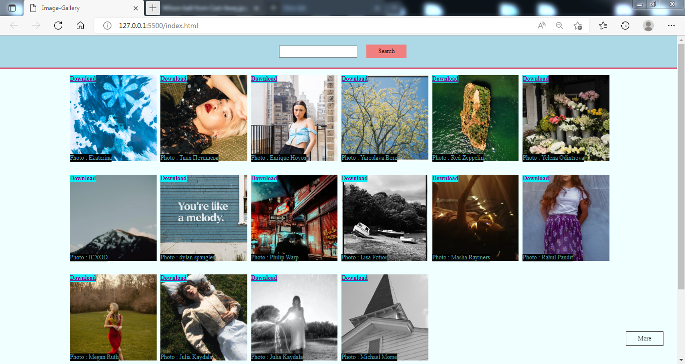
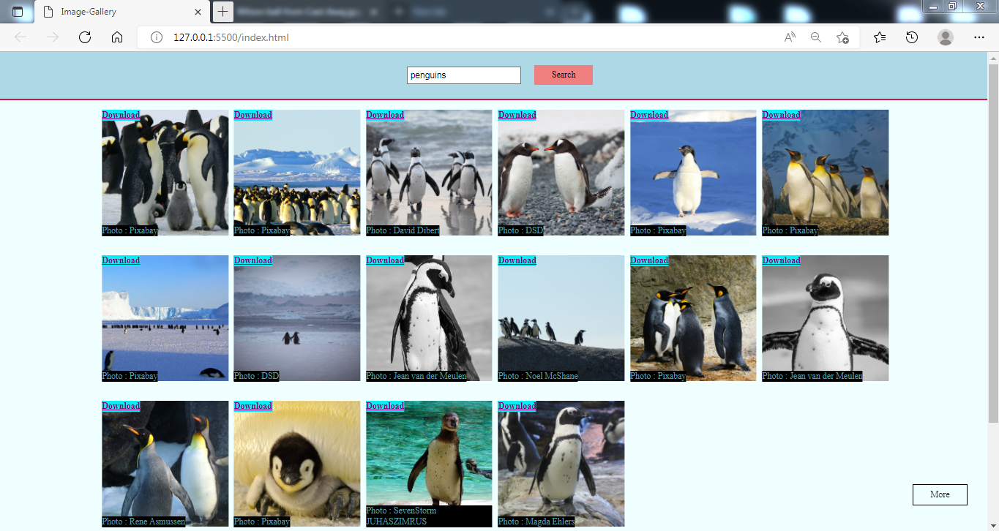
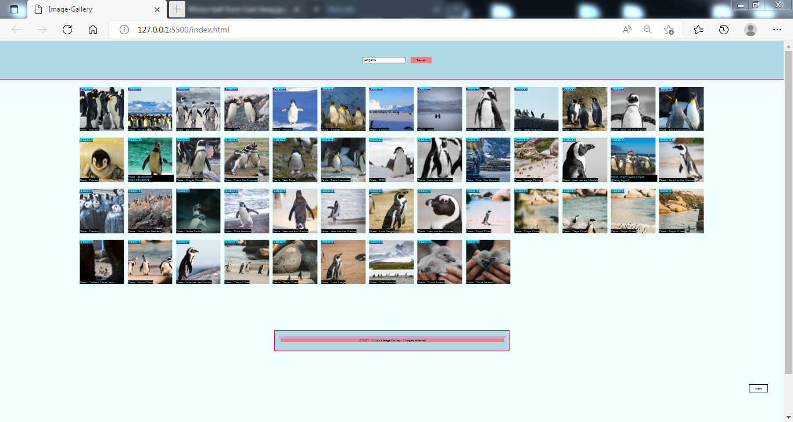
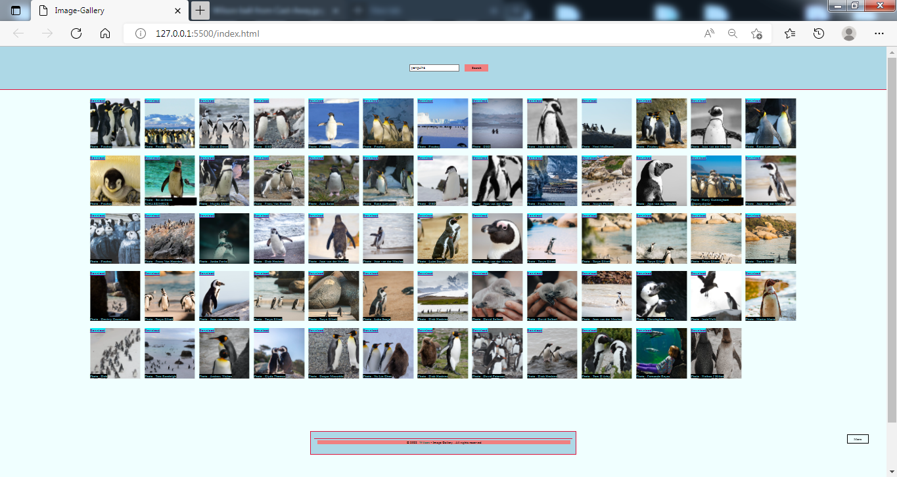

# image-gallery


## Description
<p>Fetching images through Pexel API and display as a gallery
</p>

#

<br>

## Requirements
```
- HTML/CSS files
- JavaScript file
- Pexel API key
- 
- 
```

#

## Getting started w/ Visual Studio Code
```
** git clone <insert_repo>

** Live Server VSCode extension

** 

** 
```

#

## Tasks / Goal Posts
- [X] Search bar finds images based on query
- [X] Display gallery in grid layout
- [X] Search bar grabs from Pexel API

### Optional / Wishlist
- [] Download image to email
- [] Text editor
- [] Download image locally to computer
- [] Save multiple images to PDF
- [] Invert colors with button (Night/Day switch)

#

## Default Page


## Sample Search

- Searched "penguins"

<br>


- click load x1

<br>


- click load x2

